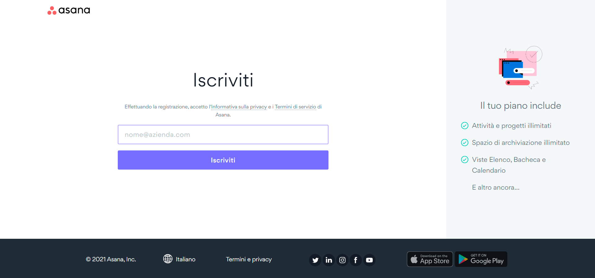

# pretest-asana

Do you know Asana? 
No problem! 
Asana is a super tool that provides teams and developers a better way to schedule task and workflow.
  
Today we will try to copy the registration page of Asana.

## registration page

## assets
To improve your work experience we have already prepared the needed graphics assets for this page, you can find that into assets dir.

## have a nice coding

